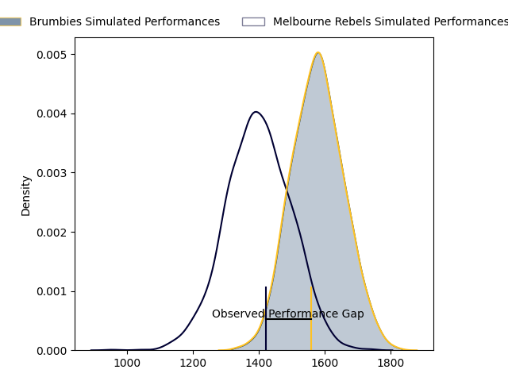
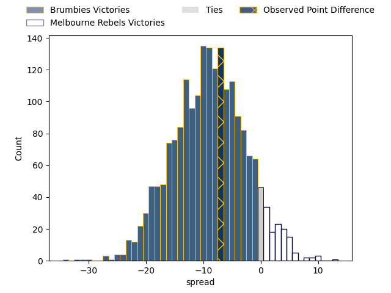

---  
layout: page  
title: Brumbies at Melbourne Rebels; 33.0-26.0  
date: 2023-05-07 00:35:00 18:00:00 -0500  
categories: match review  
---
# Brumbies at Melbourne Rebels; 33.0-26.0

# Club Level Predictions

The first set of predictions treats a club as the smallest object, as the club develops its members, organizes a gameplan, and deploys its players as needed for each match. This club model has a prediction of 0.272, which translates to predicting Brumbies to win by 8.8.

Each club has a rating and a rating deviation (simiar to a Glicko system), and expected performances can be generated. This allows for simulated matches and spreads like the ones below.
## Projected Performances

## Projected Spreads

## Projected Results

# Player Level Predictions

Treating teams instead as an entity made up of the currently active players, I have ratings for each player in an altogether different system. These can be combined to form team ratings once teamsheets are announced, weighting starters a bit higher than the reserves. After the match is played, players can be weighted by their minutes on the field, allowing for an accurate measure of the team's composition. With these compiled team ratings, we can make predictions, measure inaccuracy, and update the individual player ratings.
## Prediction with Player Minutes: Brumbies by 7.3

Brumbies by 11.3 on a neutral field

There were 10 large changes in win probability in this match
## Prediction without Player Minutes: Brumbies by 9.9

Brumbies by 13.9 on a neutral pitch

|   Away Minutes | Away Player      |   Away elo |   Away Percentile |   Number |   Home Percentile |   Home elo | Home Player      |   Home Minutes |
|---------------:|:-----------------|-----------:|------------------:|---------:|------------------:|-----------:|:-----------------|---------------:|
|             50 | James Slipper    |     141.42 |               100 |        1 |                81 |      91.74 | Matt Gibbon      |             65 |
|             71 | Lachlan Lonergan |      66.61 |                32 |        2 |                72 |      86.28 | Alex Mafi        |             60 |
|             56 | Allan Alaalatoa  |     123.28 |                98 |        3 |                80 |      90.58 | Sam Talakai      |             58 |
|             80 | Darcy Swain      |      77.03 |                51 |        4 |                60 |      81.23 | Angelo Smith     |             53 |
|             61 | Nick Frost       |      71.53 |                40 |        5 |                57 |      79.83 | Trevor Hosea     |             80 |
|             80 | Rob Valetini     |      99.71 |                87 |        6 |                40 |      71.84 | Josh Kemeny      |             80 |
|             56 | Jahrome Brown    |     113.43 |                94 |        7 |                71 |      86.71 | Brad Wilkin      |             46 |
|             80 | Pete Samu        |      87.94 |                72 |        8 |                66 |      85.2  | Richard Hardwick |             80 |
|             56 | Nic White        |     123    |                98 |        9 |                88 |     103.99 | Ryan Louwrens    |             72 |
|             56 | Noah Lolesio     |      96.15 |                80 |       10 |                69 |      88.73 | Carter Gordon    |             80 |
|             80 | Corey Toole      |      83.65 |                65 |       11 |                97 |     118.35 | Monty Ioane      |             80 |
|             73 | Tamati Tua       |      92.67 |                75 |       12 |                62 |      84.07 | Stacey Ili       |             46 |
|             80 | Len Ikitau       |     104.35 |                88 |       13 |                87 |     103.21 | Reece Hodge      |             80 |
|             80 | Andy Muirhead    |     110.05 |                93 |       14 |                52 |      77.17 | Lachie Anderson  |             65 |
|             80 | Tom Wright       |     103.49 |                86 |       15 |                83 |      99.98 | Andrew Kellaway  |             80 |
|              9 | Billy Pollard    |      85.6  |                71 |       16 |                63 |      82.14 | Jordan Uelese    |             20 |
|             30 | Blake Schoupp    |      92.88 |                78 |       17 |                42 |      74.26 | Cabous Eloff     |             15 |
|             24 | Rhys Van Nek     |      98.87 |                86 |       18 |                69 |      85.05 | Pone Fa'amausili |             22 |
|             19 | Tom Hooper       |      92.74 |               nan |       19 |               nan |     106.28 | Tim Cardall      |             27 |
|             24 | Luke Reimer      |     101.37 |                88 |       20 |                53 |      79.3  | Vaiolini Ekuasi  |             34 |
|             24 | Ryan Lonergan    |      98.9  |                84 |       21 |                83 |      99.12 | James Tuttle     |              8 |
|             24 | Jack Debreczeni  |      93.94 |                79 |       22 |                70 |      89.25 | David Feliuai    |             34 |
|              7 | Ollie Sapsford   |      81.77 |                58 |       23 |                55 |      81.69 | Joe Pincus       |             15 |

