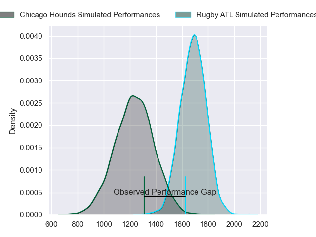
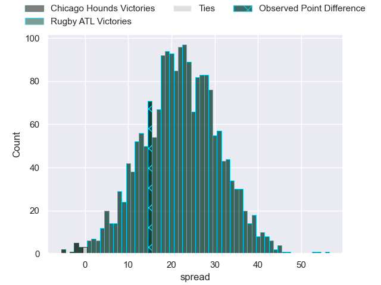

---  
layout: page  
title: Chicago Hounds at Rugby ATL; 12-27  
date: 2023-05-07 00:00:00 18:00:00 -0500  
categories: match review  
---
# Chicago Hounds at Rugby ATL; 12-27

# Club Level Predictions

The first set of predictions treats a club as the smallest object, as the club develops its members, organizes a gameplan, and deploys its players as needed for each match. This club model has a prediction of 0.911, which translates to predicting Rugby ATL to win by 22.3.

Each club has a rating and a rating deviation (simiar to a Glicko system), and expected performances can be generated. This allows for simulated matches and spreads like the ones below.
## Projected Performances

## Projected Spreads

## Projected Results

# Player Level Predictions

Treating teams instead as an entity made up of the currently active players, I have ratings for each player in an altogether different system. These can be combined to form team ratings once teamsheets are announced, weighting starters a bit higher than the reserves. After the match is played, players can be weighted by their minutes on the field, allowing for an accurate measure of the team's composition. With these compiled team ratings, we can make predictions, measure inaccuracy, and update the individual player ratings.
## Prediction with Player Minutes: Rugby ATL by 18.9

Rugby ATL by 14.9 on a neutral field
## Prediction without Player Minutes: Rugby ATL by 18.9

Rugby ATL by 14.9 on a neutral pitch

|   Away Minutes | Away Player      |   Away elo |   Away Percentile |   Number |   Home Percentile |   Home elo | Home Player            |   Home Minutes |
|---------------:|:-----------------|-----------:|------------------:|---------:|------------------:|-----------:|:-----------------------|---------------:|
|             80 | LaRome White     |      53.66 |                11 |        1 |                16 |      59.01 | Will Burke             |             80 |
|             80 | Mason Koch       |      48.21 |                 8 |        2 |                 0 |      -1.08 | Alex Maughan           |             80 |
|             80 | Paddy Ryan       |      62.15 |                20 |        3 |                30 |      68.12 | John Roy Jenkinson     |             80 |
|             80 | Cam Dodson       |      68.82 |                33 |        4 |                 7 |      50.71 | Christian Nahuel Milan |             80 |
|             80 | John Cullen      |      73.36 |                45 |        5 |                47 |      75.14 | Johannes Momsen        |             80 |
|             80 | Nkombua Justice  |      52.8  |               nan |        6 |                95 |     114.23 | Vili Helu              |             80 |
|             80 | Maclean Jones    |      38.61 |                 2 |        7 |                10 |      53.92 | Matthew Heaton         |             80 |
|             80 | Luke White       |      39.58 |                 3 |        8 |                 0 |      29.07 | Ross Deacon            |             80 |
|             80 | Sidney Shoop     |      79.08 |               nan |        9 |                41 |      72.97 | Ryan Rees              |             80 |
|             80 | Luke Carty       |      43.35 |                 4 |       10 |                 3 |      44.88 | Kurt Kendall Coleman   |             80 |
|             80 | Julian Dominguez |      48.32 |                 7 |       11 |                39 |      71.28 | Jack Shaw              |             80 |
|             80 | Bill Meakes      |      50.31 |                 8 |       12 |                64 |      85.49 | Martini Talapusi       |             80 |
|             80 | Mark O'Keeffe    |      21.79 |                 0 |       13 |               100 |     163.94 | Will Leonard           |             80 |
|             80 | Matai Leuta      |      52.67 |               nan |       14 |                20 |      60.49 | Te Rangatira Waitokia  |             80 |
|             80 | Chris Mattina    |     126.7  |                97 |       15 |                17 |      60.2  | Rewita Biddle          |             80 |

