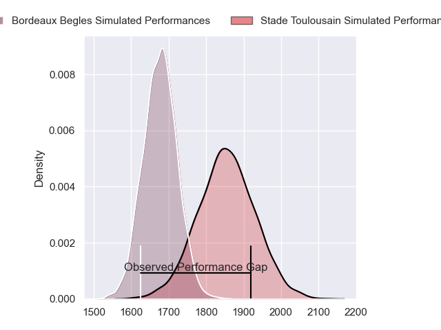
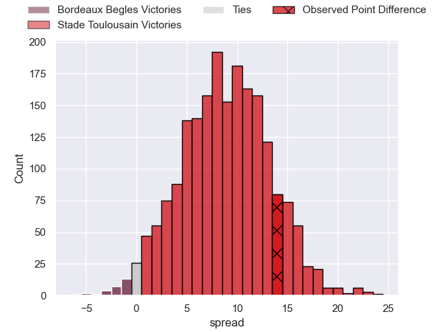
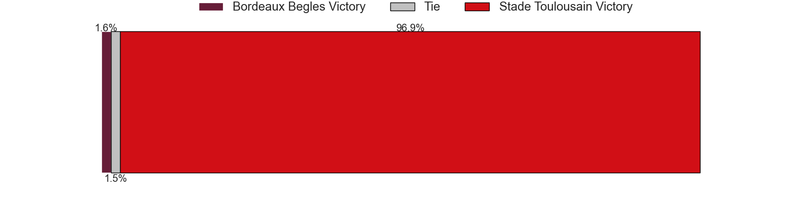

---  
layout: page  
title: Bordeaux Begles at Stade Toulousain; 17-31  
date: 2023-05-07 21:05:00 18:00:00 -0500  
categories: match review  
---
# Bordeaux Begles at Stade Toulousain; 17-31

# Club Level Predictions

The first set of predictions treats a club as the smallest object, as the club develops its members, organizes a gameplan, and deploys its players as needed for each match. This club model has a prediction of 0.734, which translates to predicting Stade Toulousain to win by 8.9.

Each club has a rating and a rating deviation (simiar to a Glicko system), and expected performances can be generated. This allows for simulated matches and spreads like the ones below.
## Projected Performances

## Projected Spreads

## Projected Results

# Player Level Predictions

Treating teams instead as an entity made up of the currently active players, I have ratings for each player in an altogether different system. These can be combined to form team ratings once teamsheets are announced, weighting starters a bit higher than the reserves. After the match is played, players can be weighted by their minutes on the field, allowing for an accurate measure of the team's composition. With these compiled team ratings, we can make predictions, measure inaccuracy, and update the individual player ratings.
## Prediction with Player Minutes: Stade Toulousain by 34.8

Stade Toulousain by 30.8 on a neutral field

There were 4 large changes in win probability in this match
## Prediction without Player Minutes: Stade Toulousain by 33.9

Stade Toulousain by 29.9 on a neutral pitch

|   Away Minutes | Away Player          |   Away elo |   Away Percentile |   Number |   Home Percentile |   Home elo | Home Player         |   Home Minutes |
|---------------:|:---------------------|-----------:|------------------:|---------:|------------------:|-----------:|:--------------------|---------------:|
|             51 | Jefferson Poirot     |      74.39 |                45 |        1 |                92 |     102.35 | Cyril Baille        |             59 |
|             51 | Gabriel Oghre        |      65.54 |                30 |        2 |                87 |      97.92 | Julien Marchand     |             58 |
|             51 | Ben Tameifuna        |      76.08 |                50 |        3 |                66 |      83.92 | Dorian Aldegheri    |             59 |
|             80 | Kane Douglas         |      62.96 |                23 |        4 |                55 |      78.77 | Richie Arnold       |             66 |
|             51 | Cyril Cazeaux        |      55.44 |                12 |        5 |                10 |      52.57 | Emmanuel Meafou     |             69 |
|             80 | Pierre Bochaton      |      57.19 |                16 |        6 |                99 |     155.16 | Francois Cros       |             80 |
|             58 | Caleb Timu           |      64.16 |               nan |        7 |                92 |     107.36 | Jack Willis         |             66 |
|             80 | Tom Willis           |      53.51 |                 9 |        8 |                 2 |      35.72 | Alexandre Roumat    |             80 |
|             59 | Maxime Lucu          |      54.52 |                11 |        9 |                98 |     122.73 | Antoine Dupont      |             73 |
|             73 | Mateo Garcia         |      68.51 |                32 |       10 |                93 |     109.82 | Romain Ntamack      |             80 |
|             80 | Santiago Cordero     |      61    |                21 |       11 |                10 |      51.6  | Matthis Lebel       |             41 |
|             80 | Yoram Moefana        |      81.95 |                58 |       12 |                27 |      65.63 | Pita Ahki           |             80 |
|             59 | Jean-Baptiste Dubié  |      60.17 |                18 |       13 |                17 |      58.9  | Santiago Chocobares |             80 |
|             80 | Louis Bielle Biarrey |      64.83 |                27 |       14 |                54 |      76.38 | Arthur Retière      |             80 |
|             80 | Nans Ducuing         |      66.04 |                26 |       15 |                96 |     124.52 | Thomas Ramos        |             80 |
|             29 | Lesko Kaulashvili    |      69.65 |                42 |       16 |                32 |      67.72 | Juan Cruz Mallia    |             39 |
|             29 | Maxime Lamothe       |      71.46 |                48 |       17 |                 7 |      46.04 | Peato Mauvaka       |             22 |
|             29 | Vadim Cobilas        |      67.96 |                41 |       18 |                22 |      61.9  | David Ainu'u        |             21 |
|             29 | Jan Andre Marais     |      68.26 |                44 |       19 |                11 |      53.15 | Rodrigue Neti       |             21 |
|             22 | Mahamadou Diaby      |      68.45 |                33 |       20 |                29 |      66.4  | Joshua Brennan      |             14 |
|             21 | Yann Lesgourgues     |      69.25 |               nan |       21 |                54 |      78.29 | Alban Placines      |             14 |
|             21 | Nicolas Depoortere   |      85    |                66 |       22 |                36 |      68.99 | Rynhard Elstadt     |             11 |
|              7 | Matthieu Jalibert    |      81.39 |                56 |       23 |                59 |      79.63 | Paul Graou          |              7 |

