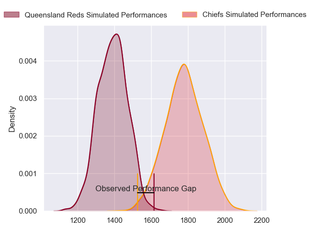
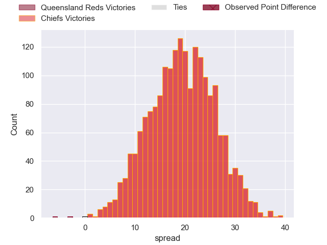

---  
layout: page  
title: Queensland Reds at Chiefs; 25.0-22.0  
date: 2023-05-12 03:05:00 18:00:00 -0500  
categories: match review  
---
# Queensland Reds at Chiefs; 25.0-22.0

# Club Level Predictions

The first set of predictions treats a club as the smallest object, as the club develops its members, organizes a gameplan, and deploys its players as needed for each match. This club model has a prediction of 0.895, which translates to predicting Chiefs to win by 19.1.

Each club has a rating and a rating deviation (simiar to a Glicko system), and expected performances can be generated. This allows for simulated matches and spreads like the ones below.
## Projected Performances

## Projected Spreads

## Projected Results

# Player Level Predictions

Treating teams instead as an entity made up of the currently active players, I have ratings for each player in an altogether different system. These can be combined to form team ratings once teamsheets are announced, weighting starters a bit higher than the reserves. After the match is played, players can be weighted by their minutes on the field, allowing for an accurate measure of the team's composition. With these compiled team ratings, we can make predictions, measure inaccuracy, and update the individual player ratings.
## Prediction with Player Minutes: Chiefs by 17.5

Chiefs by 13.5 on a neutral field

There were 10 large changes in win probability in this match
## Prediction without Player Minutes: Chiefs by 17.7

Chiefs by 13.7 on a neutral pitch

|   Away Minutes | Away Player      |   Away elo |   Away Percentile |   Number |   Home Percentile |   Home elo | Home Player            |   Home Minutes |
|---------------:|:-----------------|-----------:|------------------:|---------:|------------------:|-----------:|:-----------------------|---------------:|
|             37 | George Blake     |      84.72 |               nan |        1 |                61 |      83.59 | Jared Proffit          |             52 |
|             37 | Richie Asiata    |     105.1  |               nan |        2 |                93 |     106.87 | Bradley Slater         |             57 |
|             37 | Peni Ravai       |      83.89 |                58 |        3 |                91 |     101.1  | John Ryan              |             64 |
|             74 | Angus Blyth      |     106.33 |                91 |        4 |                48 |      75.29 | Tupou Vaa'i            |             80 |
|             80 | Connor Vest      |      86.27 |                69 |        5 |                81 |      95.06 | Josh Lord              |             13 |
|             80 | Liam Wright      |     107.78 |                92 |        6 |                94 |     110.27 | Samipeni Finau         |             80 |
|             80 | Fraser McReight  |      68.66 |                33 |        7 |                99 |     133.27 | Luke Jacobson          |             80 |
|             52 | Seru Uru         |      75    |                49 |        8 |               nan |      79.03 | Simon Parker           |             62 |
|             80 | Tate McDermott   |      95.78 |                81 |        9 |                88 |     104.88 | Cortez Ratima          |             63 |
|             41 | Lawson Creighton |      90.34 |                71 |       10 |                74 |      92.32 | Damian McKenzie        |             80 |
|             80 | Mac Grealy       |      83.64 |               nan |       11 |                91 |     104.81 | Etene Nanai-Seturo     |             80 |
|             78 | James O'Connor   |      81.28 |                56 |       12 |                79 |      95.96 | Rameka Poihipi         |             80 |
|             80 | Filipo Daugunu   |     102.4  |                89 |       13 |                97 |     120.91 | Anton Lienert-Brown    |             64 |
|             80 | Suliasi Vunivalu |      94.2  |                80 |       14 |                81 |      95.58 | Emoni Narawa           |             80 |
|             80 | Jock Campbell    |      85.53 |                68 |       15 |                77 |      95.56 | Shaun Stevenson        |             52 |
|             43 | Matt Faessler    |      78.05 |                54 |       16 |                73 |      88.68 | Tyrone Thompson        |             23 |
|             43 | Sef Fa'agase     |      84.61 |                67 |       17 |                85 |      95.14 | Ollie Norris           |             28 |
|             43 | Zane Nonggorr    |      87.95 |                74 |       18 |               nan |      93.36 | Atu Moli               |             16 |
|              6 | Ryan Smith       |      89.77 |                75 |       19 |                63 |      83.03 | Manaaki Selby-Rickit   |             67 |
|             28 | Harry Wilson     |      99.16 |                86 |       20 |                91 |     106.33 | Naitoa Ah Kuoi         |             18 |
|              0 | Louis Werchon    |      85.34 |               nan |       21 |                79 |      93.93 | Te Toiroa Tahuriorangi |             17 |
|             39 | Tom Lynagh       |      92.59 |                71 |       22 |                79 |      96.97 | Josh Ioane             |             28 |
|              2 | Patrick James    |      93.14 |               nan |       23 |                87 |     103.53 | Alex Nankivell         |             16 |

