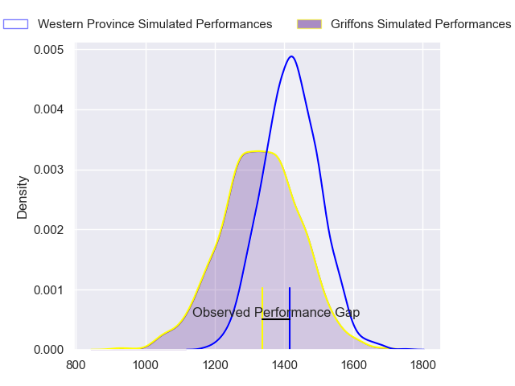
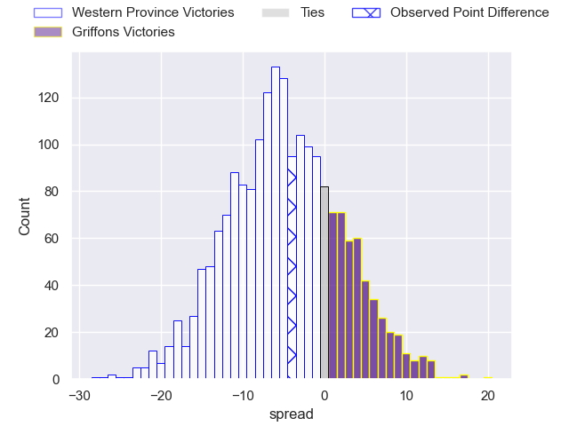
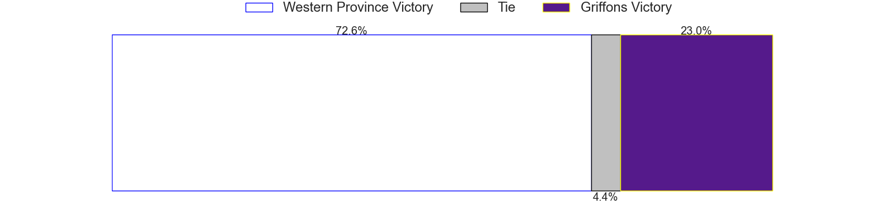

---  
layout: page  
title: Western Province at Griffons; 25-21  
date: 2023-05-12 15:00:00 18:00:00 -0500  
categories: match review  
---
# Western Province at Griffons; 25-21

# Club Level Predictions

The first set of predictions treats a club as the smallest object, as the club develops its members, organizes a gameplan, and deploys its players as needed for each match. This club model has a prediction of 0.374, which translates to predicting Western Province to win by 4.6.

Each club has a rating and a rating deviation (simiar to a Glicko system), and expected performances can be generated. This allows for simulated matches and spreads like the ones below.
## Projected Performances

## Projected Spreads

## Projected Results

# Player Level Predictions

Treating teams instead as an entity made up of the currently active players, I have ratings for each player in an altogether different system. These can be combined to form team ratings once teamsheets are announced, weighting starters a bit higher than the reserves. After the match is played, players can be weighted by their minutes on the field, allowing for an accurate measure of the team's composition. With these compiled team ratings, we can make predictions, measure inaccuracy, and update the individual player ratings.
## Prediction with Player Minutes: Western Province by 9.7

Western Province by 13.7 on a neutral field

There were 13 large changes in win probability in this match
## Prediction without Player Minutes: Western Province by 7.0

Western Province by 11.0 on a neutral pitch

|   Away Minutes | Away Player                       |   Away elo |   Away Percentile |   Number |   Home Percentile |   Home elo | Home Player                 |   Home Minutes |
|---------------:|:----------------------------------|-----------:|------------------:|---------:|------------------:|-----------:|:----------------------------|---------------:|
|             67 | Kwenzokuhle Ndumiso Blose         |      79.73 |                53 |        1 |                41 |      73.02 | Stephan de Jager            |             69 |
|             61 | Andre-Hugo Venter                 |      82.28 |                58 |        2 |                56 |      78.64 | Dandré Delport              |             13 |
|             67 | Lee-Marvin Lofty Siyanda Mazibuko |     110.24 |                96 |        3 |                75 |      88.9  | Doctor Booysen              |             69 |
|             64 | Patrick Kitete                    |      76.99 |               nan |        4 |               nan |      68.34 | Rian Olivier                |             69 |
|             80 | Adre Smith                        |      76.61 |               nan |        5 |                29 |      67.95 | Michael Benadie             |             64 |
|             11 | Junior Sipato Pokomela            |      62.19 |                16 |        6 |                93 |     107.69 | Thato Siward Mavundla       |             67 |
|             80 | Jarrod Taylor                     |      82.28 |                62 |        7 |                57 |      80.23 | Thomas Ongera               |             80 |
|             80 | Louw Nel                          |      74.64 |               nan |        8 |                13 |      54.54 | Sokuphumla (Soso) Xakalashe |             80 |
|             61 | Thomas Bursey                     |      81.66 |                60 |        9 |                70 |      87.37 | Jaywinn Juries              |             80 |
|             52 | Jean-Luc du Plessis               |      84.91 |                62 |       10 |                86 |     101.24 | Duan Pretorius              |             80 |
|             80 | Mnombo Zwelendaba                 |      93.68 |                74 |       11 |                20 |      63.53 | Domenic Smit                |             80 |
|             80 | Cornel Smit                       |      96.54 |                79 |       12 |               nan |      68.19 | Jeandre De Beer             |             52 |
|             80 | Juan de Jongh                     |      69.45 |                32 |       13 |                33 |      69.94 | Carel-Jan Coetzee           |             80 |
|             80 | Luke John Burger                  |      82.97 |                63 |       14 |                31 |      67.21 | Granwill Matthys            |             80 |
|             80 | Clayton Blommetjies               |      86.15 |                63 |       15 |                 2 |      37.33 | Duren Hoffman               |             64 |
|             69 | Albertus Horn                     |      76.26 |               nan |       16 |                48 |      76.98 | Hendrik Petrus van Schoor   |             67 |
|             28 | Jurie Matthee                     |      77.19 |               nan |       17 |                 7 |      52.65 | Keanu Armandio Vers         |             28 |
|             19 | Siyabonga Ntubeni                 |      74.49 |                47 |       18 |                27 |      65.69 | Curtley Thomas              |             16 |
|             19 | Moegamat Kannemeyer               |      73.63 |               nan |       19 |                37 |      70.58 | Randy Fillies               |             16 |
|             16 | Andre Goedhals                    |      76.8  |               nan |       20 |                47 |      76.84 | Jean-Jacques Pretorius      |             13 |
|             13 | Leon Lyons                        |      74.03 |                40 |       21 |               nan |      65.32 | Wikus Nieuwenhuis           |             11 |
|             13 | Corne Wellbach                    |      77.48 |               nan |       22 |                31 |      68.6  | Buhle Nojekwa               |             11 |
|            nan | nan                               |     nan    |               nan |       23 |               nan |      56.46 | Xolani Jacobs               |             11 |

