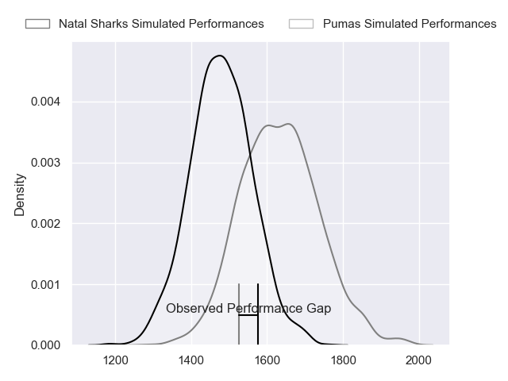
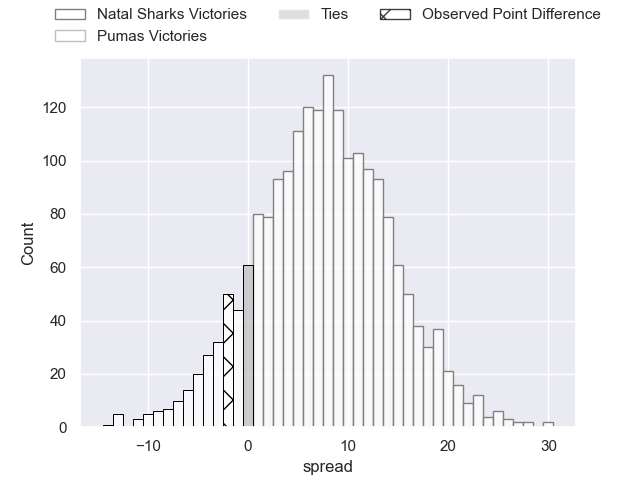
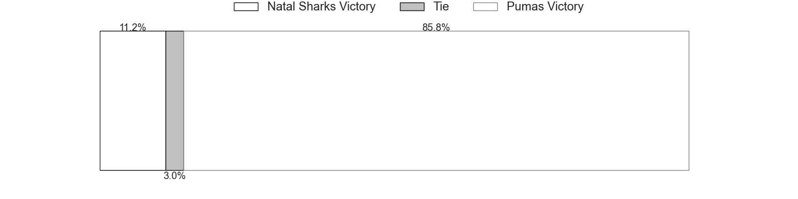

---  
layout: page  
title: Natal Sharks at Pumas; 24-22  
date: 2023-05-12 17:00:00 18:00:00 -0500  
categories: match review  
---
# Natal Sharks at Pumas; 24-22

# Club Level Predictions

The first set of predictions treats a club as the smallest object, as the club develops its members, organizes a gameplan, and deploys its players as needed for each match. This club model has a prediction of 0.702, which translates to predicting Pumas to win by 7.7.

Each club has a rating and a rating deviation (simiar to a Glicko system), and expected performances can be generated. This allows for simulated matches and spreads like the ones below.
## Projected Performances

## Projected Spreads

## Projected Results

# Player Level Predictions

Treating teams instead as an entity made up of the currently active players, I have ratings for each player in an altogether different system. These can be combined to form team ratings once teamsheets are announced, weighting starters a bit higher than the reserves. After the match is played, players can be weighted by their minutes on the field, allowing for an accurate measure of the team's composition. With these compiled team ratings, we can make predictions, measure inaccuracy, and update the individual player ratings.
## Prediction with Player Minutes: Natal Sharks by 3.2

Natal Sharks by 7.2 on a neutral field

There were 16 large changes in win probability in this match
## Prediction without Player Minutes: Pumas by 1.6

Natal Sharks by 2.4 on a neutral pitch

|   Away Minutes | Away Player                   |   Away elo |   Away Percentile |   Number |   Home Percentile |   Home elo | Home Player           |   Home Minutes |
|---------------:|:------------------------------|-----------:|------------------:|---------:|------------------:|-----------:|:----------------------|---------------:|
|             40 | Khwezi Jongamazizi Mona       |      72.28 |                39 |        1 |                45 |      74.92 | Cameron Dawson        |             57 |
|             80 | Fezokuhle Mbatha              |      87.84 |                75 |        2 |                54 |      78.03 | Llewellyn Classen     |             57 |
|             27 | Khuthuzani Kingdom Mchunu     |      86.84 |                71 |        3 |                19 |      61.27 | Njabula Juice Gumede  |             80 |
|             42 | Corne Rahl                    |      88.14 |                72 |        4 |                28 |      65.77 | Malembe Mpofu         |             58 |
|             80 | Daniel Pieter (Reniel) Hugo   |      72.88 |                43 |        5 |                91 |     105    | Shane Monro Kirkwood  |             80 |
|             80 | James Venter                  |      84.66 |                67 |        6 |                12 |      56.12 | Andre Fouché          |             66 |
|             80 | Jeandre Labuschagne           |      58.89 |                16 |        7 |                17 |      58.95 | Anele Lungisa         |             29 |
|             80 | Hendrik Petrus (Henco) Venter |     100.24 |                87 |        8 |                60 |      82.54 | Kwanda Dimaza         |             80 |
|             80 | Tiaan Fourie                  |      85.35 |                68 |        9 |                83 |      92.4  | Chriswill September   |             66 |
|             80 | Lionel Cronje                 |      76.09 |                47 |       10 |                79 |      95.64 | Tinus de Beer         |             75 |
|             80 | Aphelele Onke Okuhle Fassi    |      71.45 |                36 |       11 |               nan |      73.5  | Andrew Kota           |             80 |
|             80 | Murray Koster                 |      72.51 |                34 |       12 |                46 |      76.12 | Wian van Niekerk      |             80 |
|             42 | Josh Jonas                    |      75.03 |                44 |       13 |                33 |      69.38 | Diego Appollis        |             80 |
|             80 | Yaw Osei Penxe                |      68.16 |                32 |       14 |                30 |      66.88 | Lundi Msenge          |             80 |
|             80 | Nevaldo Fleurs                |      91.03 |                72 |       15 |                29 |      67.92 | Devon Frank Williams  |             80 |
|             53 | Hanro Jacobs                  |      68.86 |                25 |       16 |               nan |      82.37 | PJ Jacobs             |             23 |
|             40 | Dian Bleuler                  |      79.55 |                52 |       17 |                36 |      68.97 | Corne Fourie          |             23 |
|             38 | Marco De Witt                 |      75.56 |               nan |       18 |                23 |      63.7  | Deon Slabbert         |             22 |
|             38 | Marnus Potgieter              |      92.89 |                79 |       19 |                34 |      71.08 | Ruwald Van der Merwe  |             14 |
|            nan | nan                           |     nan    |               nan |       20 |                11 |      55.9  | Giovanne Snyman       |             14 |
|            nan | nan                           |     nan    |               nan |       21 |                33 |      69.65 | Brandon Terry Thomson |              5 |
|            nan | nan                           |     nan    |               nan |       22 |               nan |      52.38 | Simon Raw             |             51 |

