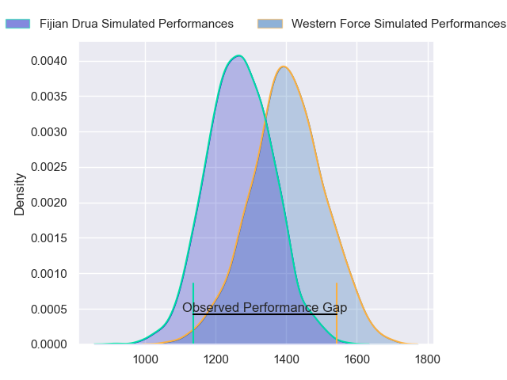
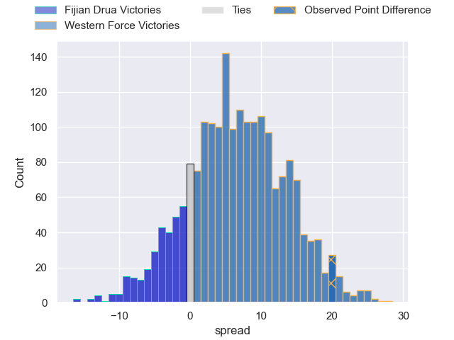
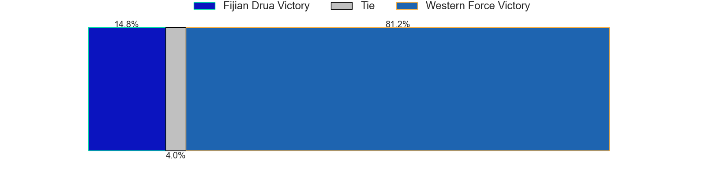

---  
layout: page  
title: Fijian Drua at Western Force; 14.0-34.0  
date: 2023-05-12 05:35:00 18:00:00 -0500  
categories: match review  
---
# Fijian Drua at Western Force; 14.0-34.0

# Club Level Predictions

The first set of predictions treats a club as the smallest object, as the club develops its members, organizes a gameplan, and deploys its players as needed for each match. This club model has a prediction of 0.681, which translates to predicting Western Force to win by 6.9.

Each club has a rating and a rating deviation (simiar to a Glicko system), and expected performances can be generated. This allows for simulated matches and spreads like the ones below.
## Projected Performances

## Projected Spreads

## Projected Results

# Player Level Predictions

Treating teams instead as an entity made up of the currently active players, I have ratings for each player in an altogether different system. These can be combined to form team ratings once teamsheets are announced, weighting starters a bit higher than the reserves. After the match is played, players can be weighted by their minutes on the field, allowing for an accurate measure of the team's composition. With these compiled team ratings, we can make predictions, measure inaccuracy, and update the individual player ratings.
## Prediction with Player Minutes: Fijian Drua by 6.5

Fijian Drua by 10.5 on a neutral field

There were 9 large changes in win probability in this match
## Prediction without Player Minutes: Fijian Drua by 4.7

Fijian Drua by 8.7 on a neutral pitch

|   Away Minutes | Away Player             |   Away elo |   Away Percentile |   Number |   Home Percentile |   Home elo | Home Player           |   Home Minutes |
|---------------:|:------------------------|-----------:|------------------:|---------:|------------------:|-----------:|:----------------------|---------------:|
|             62 | Haereiti Hetet          |      97.41 |                88 |        1 |                62 |      81.61 | Angus Wagner          |             41 |
|             68 | Tevita Ikanivere        |     113.93 |                96 |        2 |                95 |     110.42 | Folau Fainga'a        |             66 |
|             51 | Jone Koroiduadua        |      89.82 |                75 |        3 |                95 |     107.52 | Tom Robertson         |             64 |
|             76 | Isoa Nasilasila         |     117.38 |                95 |        4 |                25 |      64.6  | Jeremy Williams       |             80 |
|             51 | Te Ahiwaru Cirikidaveta |     108.41 |                92 |        5 |                70 |      90.69 | Ryan McCauley         |             47 |
|             80 | Joseva Tamani           |      75.56 |                48 |        6 |                75 |      90.36 | Michael Wells         |             76 |
|             80 | Vilive Miramira         |      82.31 |                62 |        7 |                67 |      84.94 | Carlo Tizzano         |             80 |
|             80 | Ratu Meli Derenalagi    |     101.67 |                83 |        8 |                79 |      97.29 | Rahboni Vosayaco      |             51 |
|             60 | Frank Lomani            |      73.33 |                43 |        9 |                72 |      89.29 | Issak Fines-Leleiwasa |             69 |
|             80 | Teti Tela               |      98.57 |                82 |       10 |                45 |      75.21 | Max Burey             |             80 |
|             80 | Taniela Rakuro          |      86.24 |                69 |       11 |                90 |     103.26 | Manasa Mataele        |             54 |
|             60 | Kalaveti Ravouvou       |     142.94 |                99 |       12 |                97 |     119.69 | Hamish Stewart        |             80 |
|             80 | Iosefo Masi             |      88.84 |                69 |       13 |                68 |      88.14 | Sam Spink             |             80 |
|             49 | Eroni Sau               |      77.18 |                51 |       14 |                20 |      61.28 | Zach Kibirige         |             80 |
|             80 | Ilaisa Droasese         |      97.61 |                79 |       15 |                64 |      86.76 | Chase Tiatia          |             80 |
|             12 | Zuriel Togiatama        |      76.33 |                51 |       16 |                89 |      99.69 | Tom Horton            |             14 |
|             18 | Livai Natave            |      87.17 |                72 |       17 |               nan |      79.21 | Marley Pearce         |             39 |
|             29 | Jone Tiko               |      82.38 |                70 |       18 |               nan |      86.58 | Siosifa Amone         |             16 |
|             29 | Etonia Waqa             |      83.69 |               nan |       19 |                 2 |      39.94 | Felix Kalapu          |             33 |
|              4 | Elia Canakaivata        |      79.24 |                53 |       20 |                27 |      65.78 | Tim Anstee            |             29 |
|             31 | Peni Matawalu           |      88.83 |                71 |       21 |                43 |      74.97 | Isi Naisarani         |              4 |
|             20 | Caleb Muntz             |      74.33 |                44 |       22 |                78 |      92.09 | Ian Prior             |             11 |
|             20 | Tuidraki Samusamuvodre  |      46.46 |                 6 |       23 |               nan |      84.89 | George Poolman        |             26 |

