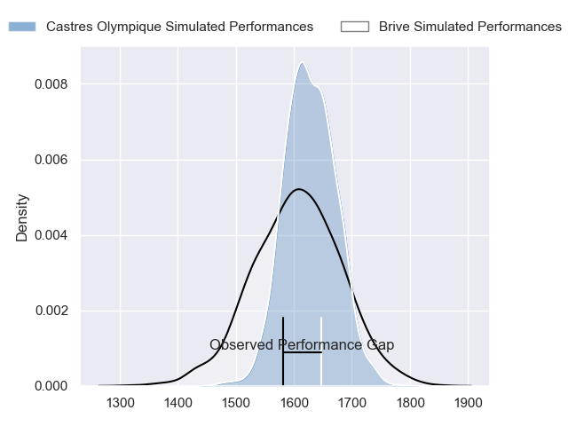
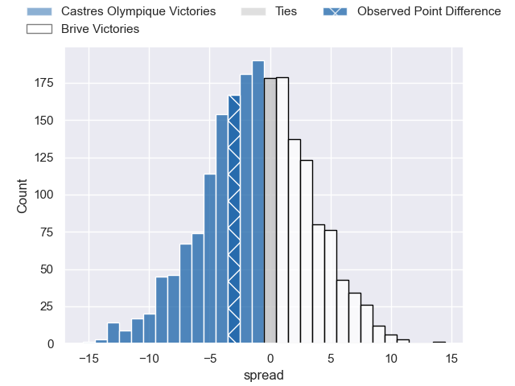

---  
layout: page  
title: Castres Olympique at Brive; 16-13  
date: 2023-05-13 17:00:00 18:00:00 -0500  
categories: match review  
---
# Castres Olympique at Brive; 16-13

# Club Level Predictions

The first set of predictions treats a club as the smallest object, as the club develops its members, organizes a gameplan, and deploys its players as needed for each match. This club model has a prediction of 0.467, which translates to predicting Castres Olympique to win by 1.1.

Each club has a rating and a rating deviation (simiar to a Glicko system), and expected performances can be generated. This allows for simulated matches and spreads like the ones below.
## Projected Performances

## Projected Spreads

## Projected Results

# Player Level Predictions

Treating teams instead as an entity made up of the currently active players, I have ratings for each player in an altogether different system. These can be combined to form team ratings once teamsheets are announced, weighting starters a bit higher than the reserves. After the match is played, players can be weighted by their minutes on the field, allowing for an accurate measure of the team's composition. With these compiled team ratings, we can make predictions, measure inaccuracy, and update the individual player ratings.
## Prediction with Player Minutes: Brive by 5.6

Brive by 1.6 on a neutral field

There were 10 large changes in win probability in this match
## Prediction without Player Minutes: Brive by 3.0

Castres Olympique by 1.0 on a neutral pitch

|   Away Minutes | Away Player                |   Away elo |   Away Percentile |   Number |   Home Percentile |   Home elo | Home Player               |   Home Minutes |
|---------------:|:---------------------------|-----------:|------------------:|---------:|------------------:|-----------:|:--------------------------|---------------:|
|             57 | Antoine Tichit             |      74.27 |                54 |        1 |                19 |      63.85 | Daniel Brennan            |             48 |
|             41 | Brendan Lebrun             |      65.47 |               nan |        2 |                46 |      72.93 | Lucas Da Silva            |             60 |
|             41 | Aurélien Azar              |      71.05 |                42 |        3 |                33 |      69.93 | Marcel van der Merwe      |             60 |
|             53 | Florent Vanverberghe       |      76.61 |                50 |        4 |                40 |      72.27 | Retief Marais             |             80 |
|             80 | Thomas Staniforth          |      57.74 |                14 |        5 |                16 |      59.58 | Lucas Martin Paulos Adler |             19 |
|             80 | Mathieu Babillot           |      64.19 |                24 |        6 |                22 |      63.14 | Esteban Abadie            |             80 |
|             49 | Nick Champion de Crespigny |      70.48 |                37 |        7 |                28 |      66.26 | Saïd Hireche              |             48 |
|             61 | Tyler Ardron               |      70.59 |                37 |        8 |                28 |      66.12 | Ross Moriarty             |             57 |
|             77 | Jeremy Fernandez           |      57.86 |                14 |        9 |                43 |      73.7  | Mathis Ferté              |             80 |
|             80 | Vilimoni Botitu            |      74.08 |                42 |       10 |                39 |      72.63 | Nicolas Sanchez           |             80 |
|             80 | Josaia Raisuqe             |      65.08 |                27 |       11 |                32 |      68.1  | Setareki Bituniyata       |             80 |
|             80 | Adrea Cocagi               |      60.18 |                20 |       12 |                54 |      78.21 | Nicolaas Jacobus Lee      |             30 |
|             80 | Adrien Seguret             |      71    |                35 |       13 |                26 |      66    | Setariki Tuicuvu          |             80 |
|             14 | Antoine Bouzerand          |      70.83 |                38 |       14 |                34 |      69.06 | Arthur Bonneval           |             80 |
|             80 | Geoffrey Palis             |      63.85 |                24 |       15 |                21 |      62.64 | Thomas Laranjeira         |             80 |
|             66 | Théo Chabouni              |      63.1  |               nan |       16 |                20 |      60.59 | Julien Delannoy           |             61 |
|             39 | Brice Humbert              |      83.64 |                67 |       17 |               nan |      71.85 | Paul Abadie               |             50 |
|             39 | Wilfried Hounkpatin        |      61.58 |                19 |       18 |                28 |      68.27 | Rodrigo Bruni             |             32 |
|             31 | Baptiste Delaporte         |      69.25 |                34 |       19 |                29 |      68.02 | Wesley Tapueluelu         |             32 |
|             27 | Leone Nakarawa             |      71.17 |                37 |       20 |                52 |      79.58 | Mesulame Kunavula         |             23 |
|             23 | Quentin Walcker            |      65.41 |                25 |       21 |               nan |      69.76 | Pietro Ceccarelli         |             20 |
|             19 | Baptiste Cope              |      83.87 |                63 |       22 |               nan |      65.58 | Vano Karkadze             |             20 |
|              3 | Julien Blanc               |      70.42 |               nan |       23 |               nan |     nan    | nan                       |            nan |

