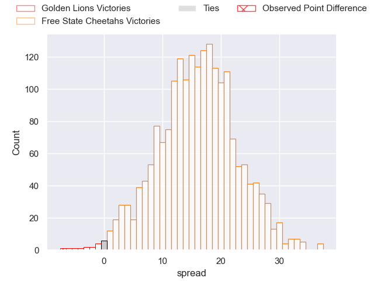
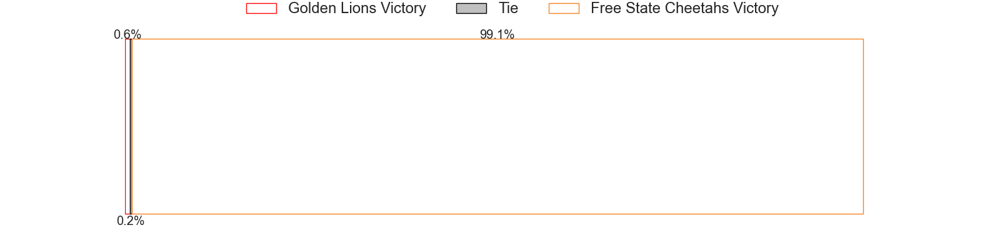

---  
layout: page  
title: Golden Lions at Free State Cheetahs; 33-26  
date: 2023-05-13 17:00:00 18:00:00 -0500  
categories: match review  
---
# Golden Lions at Free State Cheetahs; 33-26

# Club Level Predictions

The first set of predictions treats a club as the smallest object, as the club develops its members, organizes a gameplan, and deploys its players as needed for each match. This club model has a prediction of 0.852, which translates to predicting Free State Cheetahs to win by 15.7.

Each club has a rating and a rating deviation (simiar to a Glicko system), and expected performances can be generated. This allows for simulated matches and spreads like the ones below.
## Projected Performances

## Projected Spreads

## Projected Results

# Player Level Predictions

Treating teams instead as an entity made up of the currently active players, I have ratings for each player in an altogether different system. These can be combined to form team ratings once teamsheets are announced, weighting starters a bit higher than the reserves. After the match is played, players can be weighted by their minutes on the field, allowing for an accurate measure of the team's composition. With these compiled team ratings, we can make predictions, measure inaccuracy, and update the individual player ratings.
## Prediction with Player Minutes: Free State Cheetahs by 15.2

Free State Cheetahs by 11.2 on a neutral field
## Prediction without Player Minutes: Free State Cheetahs by 15.2

Free State Cheetahs by 11.2 on a neutral pitch

|   Away Minutes | Away Player                |   Away elo |   Away Percentile |   Number |   Home Percentile |   Home elo | Home Player              |   Home Minutes |
|---------------:|:---------------------------|-----------:|------------------:|---------:|------------------:|-----------:|:-------------------------|---------------:|
|             80 | Rhynardt Rijnsburger       |      96.03 |                87 |        1 |                60 |      81.04 | Schalk Ferreira          |             80 |
|             80 | Gerrit Jacobus Visagie     |      72.34 |                42 |        2 |               nan |      86.51 | Louis van der Westhuizen |             80 |
|             80 | Asenathi Ntlabakanye       |      61.78 |                19 |        3 |                70 |      83.94 | Hencus van Wyk           |             80 |
|             80 | Ruan Venter                |      73.14 |                43 |        4 |                43 |      72.88 | Rynier Mark Bernardo     |             80 |
|             80 | Ruben (Hobo) Schoeman      |      84.07 |                65 |        5 |                66 |      84.42 | Victor Kutlwano Sekekete |             80 |
|             80 | Johannes JC Pretorius      |      83.14 |                64 |        6 |                32 |      68.48 | Gideon van der Merwe     |             80 |
|             80 | Emmanuel Tshituka          |      65.1  |                26 |        7 |                69 |      85.92 | Sibabalo Qoma            |             80 |
|             80 | Francke Horn               |      74.95 |                44 |        8 |                71 |      86.93 | George Cronje            |             80 |
|             80 | Morne van der Berg         |      69.07 |                32 |        9 |                60 |      82.05 | Ruan Pienaar             |             80 |
|             80 | Sanele Nohamba             |      72.37 |                39 |       10 |                65 |      85.75 | Reinhardt Fortuin        |             80 |
|             80 | Edwill Charl van der Merwe |      69.77 |                36 |       11 |                77 |      91.13 | Munier Hartzenberg       |             80 |
|             80 | Tyler Bocks                |      70.08 |                42 |       12 |                40 |      72.52 | Robert Thompson Ebersohn |             80 |
|             80 | Rynardt Jonker             |      86.14 |                65 |       13 |                75 |      92.39 | David Benjamin Brits     |             80 |
|             80 | Sibahle Ndiphiwe Maxwane   |      74.56 |                47 |       14 |                77 |      90.97 | Daniel Kasende Kalepula  |             80 |
|             80 | Quan Horn                  |      70.05 |                33 |       15 |                34 |      69.85 | Evardi Boshoff           |             80 |

