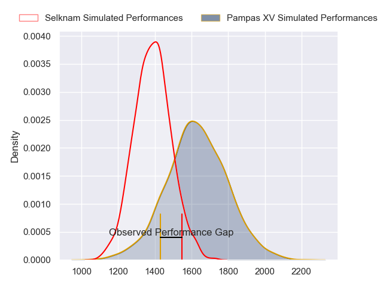
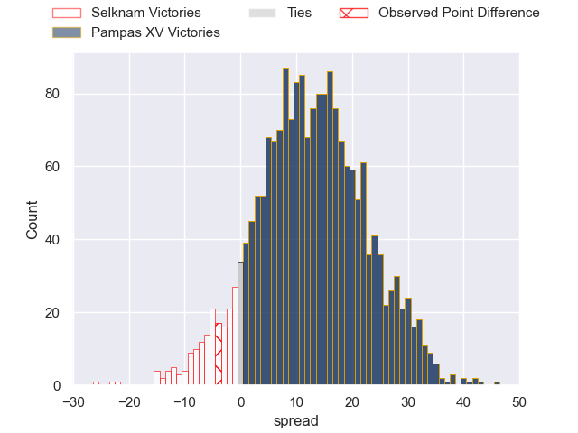
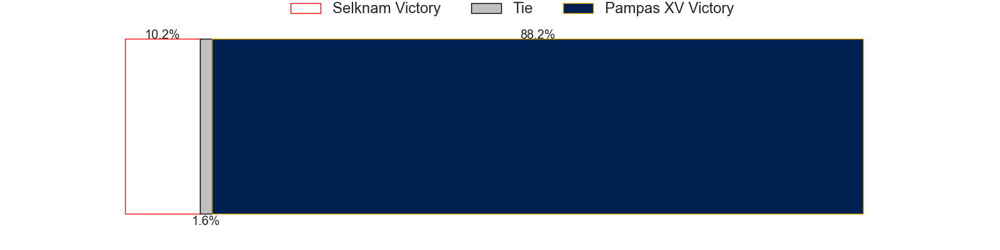

---  
layout: page  
title: Selknam at Pampas XV; 23-19  
date: 2023-05-13 01:00:00 18:00:00 -0500  
categories: match review  
---
# Selknam at Pampas XV; 23-19

# Club Level Predictions

The first set of predictions treats a club as the smallest object, as the club develops its members, organizes a gameplan, and deploys its players as needed for each match. This club model has a prediction of 0.79, which translates to predicting Pampas XV to win by 12.1.

Each club has a rating and a rating deviation (simiar to a Glicko system), and expected performances can be generated. This allows for simulated matches and spreads like the ones below.
## Projected Performances

## Projected Spreads

## Projected Results

# Player Level Predictions

Treating teams instead as an entity made up of the currently active players, I have ratings for each player in an altogether different system. These can be combined to form team ratings once teamsheets are announced, weighting starters a bit higher than the reserves. After the match is played, players can be weighted by their minutes on the field, allowing for an accurate measure of the team's composition. With these compiled team ratings, we can make predictions, measure inaccuracy, and update the individual player ratings.
## Prediction with Player Minutes: Pampas XV by 10.4

Pampas XV by 6.4 on a neutral field
## Prediction without Player Minutes: Pampas XV by 10.4

Pampas XV by 6.4 on a neutral pitch

|   Away Minutes | Away Player             |   Away elo |   Away Percentile |   Number |   Home Percentile |   Home elo | Home Player                    |   Home Minutes |
|---------------:|:------------------------|-----------:|------------------:|---------:|------------------:|-----------:|:-------------------------------|---------------:|
|             80 | Vittorio Lastra         |      55.63 |               nan |        1 |                63 |      82.47 | Rodrigo Martinez Manzano       |             80 |
|             80 | Augusto Bohme           |      56.52 |               nan |        2 |                32 |      65.26 | Ramiro Gurovich                |             80 |
|             80 | Esteban Inostroza       |      55.59 |                10 |        3 |                 6 |      50.58 | Javier Corvalan                |             80 |
|             80 | Clemente Saavedra       |      58.08 |                15 |        4 |                12 |      54.07 | Manuel Bernstein               |             80 |
|             80 | Pablo Huete             |      63.68 |                23 |        5 |                 2 |      38.42 | Eliseo Fourcade                |             80 |
|             80 | Alfonso Escobar Alvarez |      53.17 |                 9 |        6 |                13 |      55.65 | Eliseo Chiavassa               |             80 |
|             80 | Raimundo Martinez       |      42.64 |                 3 |        7 |                 9 |      52.27 | Jeronimo Ureta                 |             80 |
|             80 | Joaquin Milesi          |      78.9  |                52 |        8 |                30 |      68.92 | Santiago Ruiz                  |             80 |
|             80 | Nicolas Herreros        |      47.43 |                 5 |        9 |                11 |      55.39 | Eliseo Nicolas Morales Abraham |             80 |
|             80 | Francisco Urroz         |      59.93 |                17 |       10 |                 4 |      42.51 | Joaquin de la Vega Mendia      |             80 |
|             80 | Cristobal Game          |      52.9  |               nan |       11 |                17 |      59.21 | Benjamin Elizalde              |             80 |
|             80 | Pablo Casas             |      43.32 |                 2 |       12 |                13 |      55.91 | Felipe de la Vega              |             80 |
|             80 | Domingo Saavedra        |      74    |                42 |       13 |                47 |      76.63 | Juan Pablo Castro Collado      |             80 |
|             80 | Nicolas Garafulic Schar |      69.71 |                36 |       14 |                56 |      79.21 | Inaki Delguy                   |             80 |
|             80 | Santiago Videla         |      49    |                 7 |       15 |                66 |      88.15 | Juan Ignacio Lando             |             80 |

