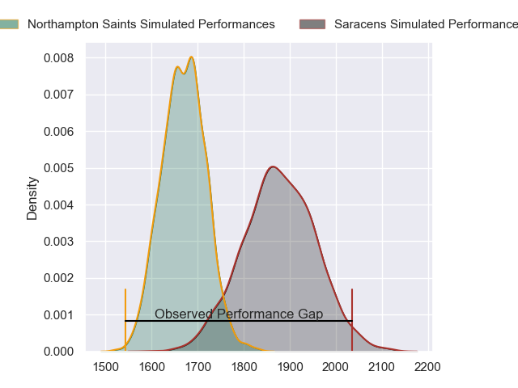
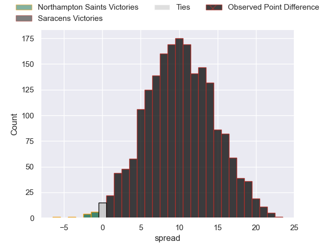
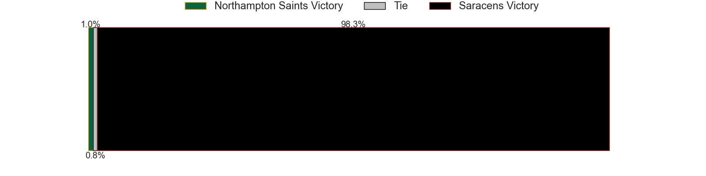

---  
layout: page  
title: Northampton Saints at Saracens; 15.0-38.0  
date: 2023-05-13 10:30:00 18:00:00 -0500  
categories: match review  
---
# Northampton Saints at Saracens; 15.0-38.0

# Club Level Predictions

The first set of predictions treats a club as the smallest object, as the club develops its members, organizes a gameplan, and deploys its players as needed for each match. This club model has a prediction of 0.762, which translates to predicting Saracens to win by 10.2.

Each club has a rating and a rating deviation (simiar to a Glicko system), and expected performances can be generated. This allows for simulated matches and spreads like the ones below.
## Projected Performances

## Projected Spreads

## Projected Results

# Player Level Predictions

Treating teams instead as an entity made up of the currently active players, I have ratings for each player in an altogether different system. These can be combined to form team ratings once teamsheets are announced, weighting starters a bit higher than the reserves. After the match is played, players can be weighted by their minutes on the field, allowing for an accurate measure of the team's composition. With these compiled team ratings, we can make predictions, measure inaccuracy, and update the individual player ratings.
## Prediction with Player Minutes: Saracens by 19.2

Saracens by 15.2 on a neutral field

There were 3 large changes in win probability in this match
## Prediction without Player Minutes: Saracens by 16.8

Saracens by 12.8 on a neutral pitch

|   Away Minutes | Away Player          |   Away elo |   Away Percentile |   Number |   Home Percentile |   Home elo | Home Player        |   Home Minutes |
|---------------:|:---------------------|-----------:|------------------:|---------:|------------------:|-----------:|:-------------------|---------------:|
|             41 | Alex Waller          |     138.12 |                99 |        1 |                96 |     110.98 | Mako Vunipola      |             69 |
|             50 | Tom Cruse            |      60.88 |                13 |        2 |                99 |     132.1  | Jamie George       |             72 |
|             50 | Trevor Davison       |      66.71 |                27 |        3 |                55 |      78.68 | Marco Riccioni     |             74 |
|             80 | David Ribbans        |     104.29 |                90 |        4 |                84 |      97.34 | Maro Itoje         |             80 |
|             57 | Alex Moon            |     124.49 |                97 |        5 |                11 |      57.77 | Hugh Tizard        |             75 |
|             72 | Courtney Lawes       |      85.28 |                67 |        6 |                65 |      83.92 | Nick Isiekwe       |             49 |
|             80 | Lewis Ludlam         |      75.77 |                48 |        7 |                92 |     106.39 | Ben Earl           |             80 |
|             57 | Juarno Augustus      |      80.53 |                55 |        8 |                98 |     118.91 | Jackson Wray       |             80 |
|             66 | Alex Mitchell        |     101.27 |                87 |        9 |                97 |     119.07 | Ivan van Zyl       |             75 |
|             80 | Fin Smith            |      87.99 |                68 |       10 |                98 |     135.37 | Owen Farrell       |             80 |
|             80 | Tommy Freeman        |     102.99 |                90 |       11 |                96 |     114.3  | Sean Maitland      |             80 |
|             80 | Rory Hutchinson      |      88.7  |                69 |       12 |                99 |     142.01 | Nick Tompkins      |             66 |
|             77 | Fraser Dingwall      |      76.3  |                46 |       13 |                72 |      91.06 | Alex Lozowski      |             80 |
|             80 | James Ramm           |     105.3  |                91 |       14 |                70 |      86.97 | Max Malins         |             80 |
|             80 | George Furbank       |     120.96 |                95 |       15 |                96 |     123.75 | Alex Goode         |             66 |
|             30 | Robbie Smith         |      93.71 |                82 |       16 |                81 |      93.26 | Theo Dan           |              8 |
|             39 | Ethan Waller         |      90.72 |                74 |       17 |                 2 |      42.26 | Eroni Mawi         |             11 |
|             30 | Paul Hill            |     102.59 |                92 |       18 |                58 |      79.86 | Christian Judge    |              6 |
|             23 | Lukhan Salakaia-Loto |      63.01 |                22 |       19 |                54 |      78.28 | Callum Hunter-Hill |             31 |
|              8 | Angus Scott-Young    |     106.86 |                91 |       20 |                54 |      78.67 | Toby Knight        |              5 |
|             23 | Sam Graham           |     128.47 |                98 |       21 |                63 |      83.35 | Ruben de Haas      |              5 |
|             14 | Tom James            |      85.78 |                67 |       22 |                80 |      97.68 | Duncan Taylor      |             14 |
|              3 | Tom Collins          |     104.23 |                91 |       23 |                82 |     101.56 | Elliot Daly        |             14 |

