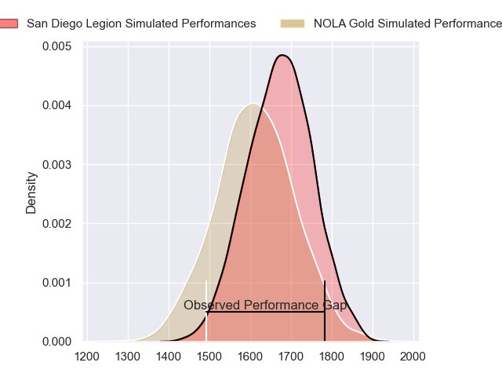
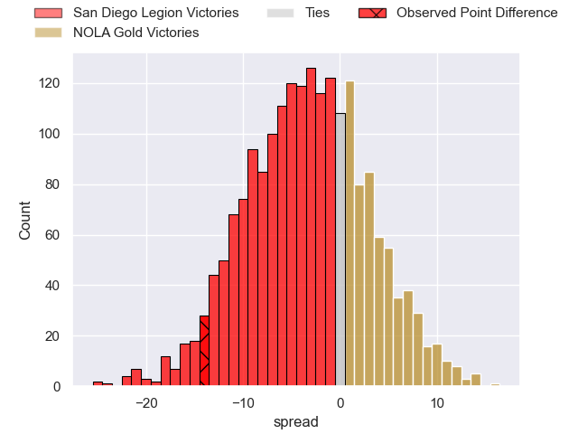

---  
layout: page  
title: San Diego Legion at NOLA Gold; 26-12  
date: 2023-05-14 00:00:00 18:00:00 -0500  
categories: match review  
---
# San Diego Legion at NOLA Gold; 26-12

# Club Level Predictions

The first set of predictions treats a club as the smallest object, as the club develops its members, organizes a gameplan, and deploys its players as needed for each match. This club model has a prediction of 0.411, which translates to predicting San Diego Legion to win by 3.2.

Each club has a rating and a rating deviation (simiar to a Glicko system), and expected performances can be generated. This allows for simulated matches and spreads like the ones below.
## Projected Performances

## Projected Spreads

## Projected Results

# Player Level Predictions

Treating teams instead as an entity made up of the currently active players, I have ratings for each player in an altogether different system. These can be combined to form team ratings once teamsheets are announced, weighting starters a bit higher than the reserves. After the match is played, players can be weighted by their minutes on the field, allowing for an accurate measure of the team's composition. With these compiled team ratings, we can make predictions, measure inaccuracy, and update the individual player ratings.
## Prediction with Player Minutes: San Diego Legion by 3.5

San Diego Legion by 7.5 on a neutral field
## Prediction without Player Minutes: San Diego Legion by 3.5

San Diego Legion by 7.5 on a neutral pitch

|   Away Minutes | Away Player          |   Away elo |   Away Percentile |   Number |   Home Percentile |   Home elo | Home Player                              |   Home Minutes |
|---------------:|:---------------------|-----------:|------------------:|---------:|------------------:|-----------:|:-----------------------------------------|---------------:|
|             80 | Nathan Sylvia        |      63.33 |                29 |        1 |                17 |      60.01 | Jarred Adams                             |             80 |
|             80 | Shilo Klein          |      70.25 |                39 |        2 |                20 |      60.4  | Eric Howard                              |             80 |
|             80 | Luke Green           |      62.86 |                21 |        3 |                21 |      62.93 | Sean Bradley Paranihi                    |             80 |
|             80 | Ben Grant            |      95.98 |                84 |        4 |                23 |      65.31 | Cameron Dolan                            |             80 |
|             80 | Isaac Ross           |      66.38 |                29 |        5 |                31 |      67.34 | Will Waguespack                          |             80 |
|             80 | Michael Smith        |      64.18 |               nan |        6 |               nan |      58.45 | Alex Lopeti                              |             80 |
|             80 | Finn Kearns          |      60.94 |               nan |        7 |                26 |      65.59 | Malcolm May                              |             80 |
|             80 | Dan Pryor            |      66.16 |                28 |        8 |                 0 |      25.86 | Moni Tonga'uiha                          |             80 |
|             80 | Jason Higgins        |      59.99 |                18 |        9 |                44 |      74.39 | Luke Campbell                            |             80 |
|             80 | Josh Henderson       |      59.84 |                16 |       10 |               nan |      55.91 | Reece Botha                              |             80 |
|             80 | Nathaniel Augspurger |      57.89 |                16 |       11 |                10 |      53.19 | Ross Depperschmidt                       |             80 |
|             80 | Tiaan Loots          |      79.55 |                53 |       12 |                27 |      66.21 | Jordan Jackson-Hope                      |             80 |
|             80 | Marcel Brache        |      65.8  |                26 |       13 |                34 |      70.03 | Philippus Jacobus Snyman (JP) du Plessis |             80 |
|             80 | Filimona Waqainabete |      75.9  |                46 |       14 |                40 |      73.31 | Harley Wheeler                           |             80 |
|             80 | Matias Freyre        |      46.2  |                 7 |       15 |                19 |      60.92 | Jordan Trainor                           |             80 |

