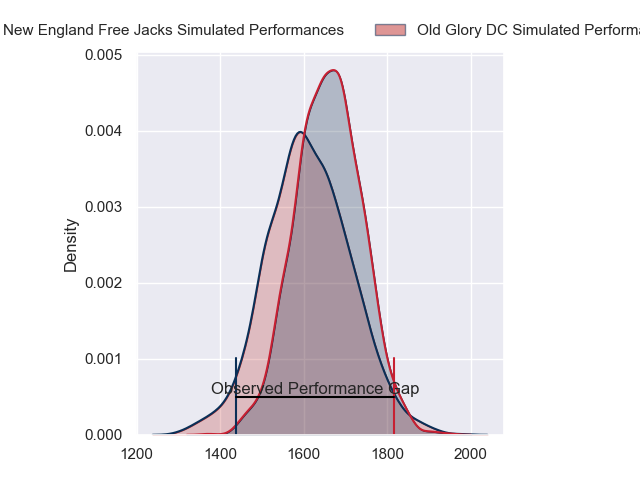
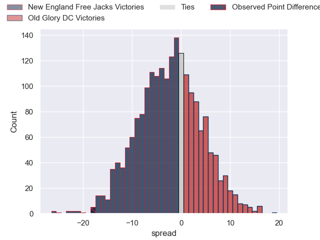

---  
layout: page  
title: New England Free Jacks at Old Glory DC; 42-24  
date: 2023-05-14 19:30:00 18:00:00 -0500  
categories: match review  
---
# New England Free Jacks at Old Glory DC; 42-24

# Club Level Predictions

The first set of predictions treats a club as the smallest object, as the club develops its members, organizes a gameplan, and deploys its players as needed for each match. This club model has a prediction of 0.434, which translates to predicting New England Free Jacks to win by 2.4.

Each club has a rating and a rating deviation (simiar to a Glicko system), and expected performances can be generated. This allows for simulated matches and spreads like the ones below.
## Projected Performances

## Projected Spreads

## Projected Results

# Player Level Predictions

Treating teams instead as an entity made up of the currently active players, I have ratings for each player in an altogether different system. These can be combined to form team ratings once teamsheets are announced, weighting starters a bit higher than the reserves. After the match is played, players can be weighted by their minutes on the field, allowing for an accurate measure of the team's composition. With these compiled team ratings, we can make predictions, measure inaccuracy, and update the individual player ratings.
## Prediction with Player Minutes: New England Free Jacks by 0.8

New England Free Jacks by 4.8 on a neutral field

There were 6 large changes in win probability in this match
## Prediction without Player Minutes: New England Free Jacks by 0.8

New England Free Jacks by 4.8 on a neutral pitch

|   Away Minutes | Away Player        |   Away elo |   Away Percentile |   Number |   Home Percentile |   Home elo | Home Player              |   Home Minutes |
|---------------:|:-------------------|-----------:|------------------:|---------:|------------------:|-----------:|:-------------------------|---------------:|
|             80 | Kyle Ciquera       |      73.21 |                51 |        1 |                 1 |      38.71 | Jack Iscaro              |             80 |
|             80 | Millenium Sanerivi |      59.77 |                19 |        2 |                40 |      71.1  | Nic Souchon              |             80 |
|             80 | Cole Keith         |      71.89 |                38 |        3 |                26 |      66.22 | Kyle Stewart             |             80 |
|             80 | Conor Keys         |      71.5  |                38 |        4 |                 9 |      52.57 | Tevita Naqali            |             80 |
|             80 | Reegan O'Gorman    |      55.29 |               nan |        5 |                29 |      67.02 | Kyle Baillie             |             80 |
|             80 | Sam Fischli        |      54.95 |                11 |        6 |                53 |      77.9  | Lautaro Ezequiel Bavaro  |             80 |
|             80 | Mitchell Jacobson  |      51    |                 7 |        7 |                40 |      71.68 | Niko Jones               |             80 |
|             80 | Wian Conradie      |      86.66 |                70 |        8 |                77 |      91.3  | Jamason Fa'anana Schultz |             80 |
|             80 | John Poland        |      89.32 |                72 |        9 |                14 |      57.04 | Danny Joseph Tusitala    |             80 |
|             80 | Jayson Potroz      |      84.38 |                61 |       10 |                36 |      70.73 | Gradyn Bowd              |             80 |
|             80 | Paul Balekana      |      85.14 |                67 |       11 |                32 |      67.88 | Tafeaga Junior Sau       |             80 |
|             80 | Le Roux Malan      |      58.12 |                15 |       12 |                28 |      67.04 | Thretton Palamo          |             80 |
|             80 | Ben Lesage         |      63.62 |                23 |       13 |                 1 |      39.14 | William Talataina-Mu     |             80 |
|             80 | Mitchell Wilson    |      67.86 |                32 |       14 |                32 |      67.75 | Peni Lasaqa              |             80 |
|             80 | Reece MacDonald    |      45.06 |                 6 |       15 |                20 |      63.68 | Joaquin Diaz Bonilla     |             80 |

