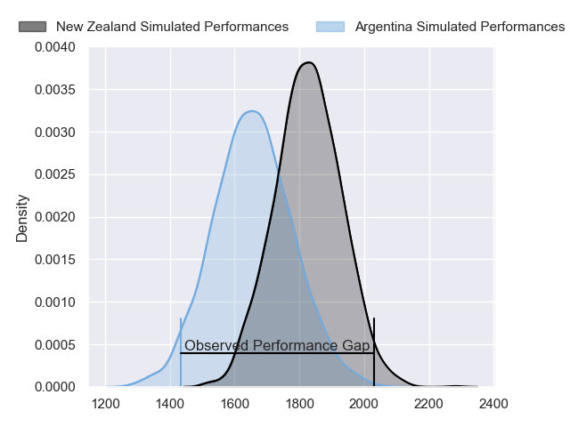
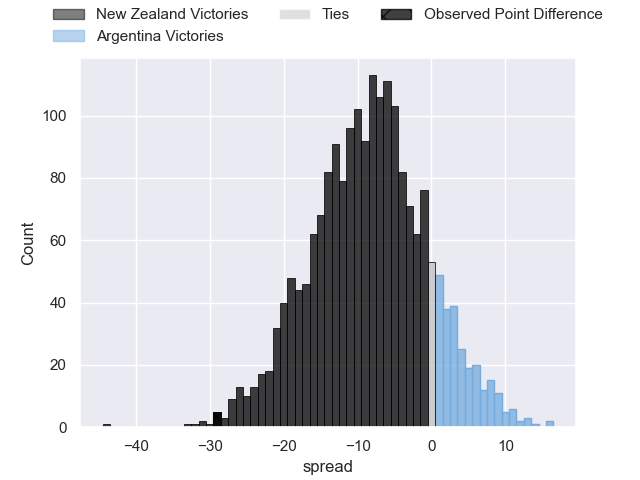
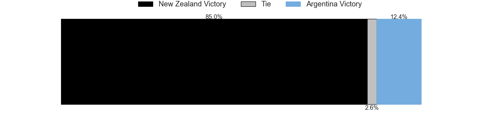

---  
layout: page  
title: New Zealand at Argentina; 41.0-12.0  
date: 2023-07-08 15:10:00 18:00:00 -0500  
categories: match review  
---
# New Zealand at Argentina; 41.0-12.0

# Club Level Predictions

The first set of predictions treats a club as the smallest object, as the club develops its members, organizes a gameplan, and deploys its players as needed for each match. This club model has a prediction of 0.287, which translates to predicting New Zealand to win by 8.3.

Each club has a rating and a rating deviation (simiar to a Glicko system), and expected performances can be generated. This allows for simulated matches and spreads like the ones below.
## Projected Performances

## Projected Spreads

## Projected Results

# Player Level Predictions

Treating teams instead as an entity made up of the currently active players, I have ratings for each player in an altogether different system. These can be combined to form team ratings once teamsheets are announced, weighting starters a bit higher than the reserves. After the match is played, players can be weighted by their minutes on the field, allowing for an accurate measure of the team's composition. With these compiled team ratings, we can make predictions, measure inaccuracy, and update the individual player ratings.
## Prediction with Player Minutes: New Zealand by 17.7

New Zealand by 21.7 on a neutral field

There were 2 large changes in win probability in this match
## Prediction without Player Minutes: New Zealand by 19.0

New Zealand by 23.0 on a neutral pitch

|   Away Minutes | Away Player     |   Away elo |   Away Percentile |   Number |   Home Percentile |   Home elo | Home Player           |   Home Minutes |
|---------------:|:----------------|-----------:|------------------:|---------:|------------------:|-----------:|:----------------------|---------------:|
|             54 | Ethan de Groot  |      87.5  |                71 |        1 |                85 |      94.73 | Thomas Gallo          |             65 |
|             47 | Dane Coles      |     119.98 |                97 |        2 |                81 |      94.38 | Julian Montoya        |             69 |
|             61 | Tyrel Lomax     |     136.72 |                99 |        3 |               nan |      85.55 | Lucio Sordoni         |             65 |
|             82 | Scott Barrett   |     128.15 |                97 |        4 |                90 |     106.35 | Matias Alemanno       |             82 |
|             54 | Josh Lord       |      94.34 |                78 |        5 |                96 |     121.43 | Tomas Lavanini        |             62 |
|             67 | Shannon Frizell |      99.11 |                84 |        6 |                97 |     118.29 | Pablo Matera          |             82 |
|             82 | Sam Cane        |     127.35 |                98 |        7 |                56 |      79.52 | Juan Martin Gonzalez  |             61 |
|             82 | Ardie Savea     |     120.75 |                96 |        8 |                42 |      74.11 | Rodrigo Bruni         |             82 |
|             61 | Aaron Smith     |      89.39 |                69 |        9 |                75 |      93.46 | Gonzalo Bertranou     |             65 |
|             82 | Damian McKenzie |      86.27 |                61 |       10 |                95 |     122.33 | Santiago Carreras     |             82 |
|             82 | Caleb Clarke    |      95.13 |                78 |       11 |                41 |      74.17 | Mateo Carreras        |             82 |
|             82 | Jordie Barrett  |     109.66 |                92 |       12 |                33 |      70.41 | Lucio Cinti           |             82 |
|             75 | Rieko Ioane     |      81.54 |                56 |       13 |                47 |      77    | Matias Moroni         |             54 |
|             82 | Emoni Narawa    |      76.57 |                46 |       14 |               nan |      85.74 | Sebastian Cancelliere |             54 |
|             61 | Beauden Barrett |     142.65 |                99 |       15 |                23 |      65.77 | Emiliano Boffelli     |             82 |
|             35 | Codie Taylor    |      93.2  |                80 |       16 |                96 |     114.78 | Agustin Creevy        |             13 |
|             28 | Ofa Tu'ungafasi |     101.47 |                90 |       17 |                 6 |      53.48 | Mayco Vivas           |             17 |
|             21 | Nepo Laulala    |     104.17 |                93 |       18 |                74 |      88.21 | Eduardo Bello         |             17 |
|             28 | Tupou Vaa'i     |      71.05 |                36 |       19 |                60 |      81.18 | Pedro Rubiolo         |             20 |
|             15 | Dalton Papali'i |     101.39 |                87 |       20 |                47 |      75.86 | Santiago Grondona     |             21 |
|             21 | Finlay Christie |      97.31 |                80 |       21 |                67 |      84.67 | Lautaro Bazan Velez   |             17 |
|             21 | Richie Mo'unga  |     144.34 |               100 |       22 |                99 |     141.36 | Nicolas Sanchez       |             28 |
|              7 | Braydon Ennor   |     105.85 |                89 |       23 |                21 |      63.93 | Matias Orlando        |             28 |

