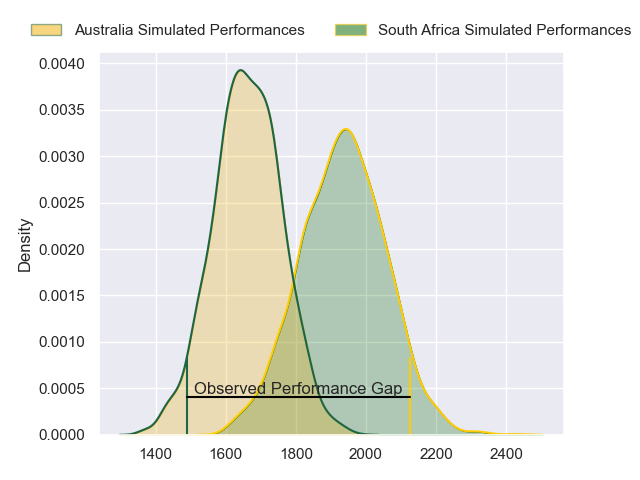
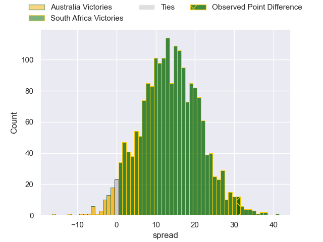

---  
layout: page  
title: Australia at South Africa; 12.0-43.0  
date: 2023-07-08 11:05:00 18:00:00 -0500  
categories: match review  
---
# Australia at South Africa; 12.0-43.0

# Club Level Predictions

The first set of predictions treats a club as the smallest object, as the club develops its members, organizes a gameplan, and deploys its players as needed for each match. This club model has a prediction of 0.819, which translates to predicting South Africa to win by 13.7.

Each club has a rating and a rating deviation (simiar to a Glicko system), and expected performances can be generated. This allows for simulated matches and spreads like the ones below.
## Projected Performances

## Projected Spreads

## Projected Results

# Player Level Predictions

Treating teams instead as an entity made up of the currently active players, I have ratings for each player in an altogether different system. These can be combined to form team ratings once teamsheets are announced, weighting starters a bit higher than the reserves. After the match is played, players can be weighted by their minutes on the field, allowing for an accurate measure of the team's composition. With these compiled team ratings, we can make predictions, measure inaccuracy, and update the individual player ratings.
## Prediction with Player Minutes: Australia by 5.6

Australia by 9.6 on a neutral field

There were 4 large changes in win probability in this match
## Prediction without Player Minutes: Australia by 6.5

Australia by 10.5 on a neutral pitch

|   Away Minutes | Away Player      |   Away elo |   Away Percentile |   Number |   Home Percentile |   Home elo | Home Player          |   Home Minutes |
|---------------:|:-----------------|-----------:|------------------:|---------:|------------------:|-----------:|:---------------------|---------------:|
|             65 | James Slipper    |     145.17 |               100 |        1 |                89 |     100.3  | Steven Kitshoff      |             63 |
|             65 | Dave Porecki     |     105.56 |                91 |        2 |                95 |     112.34 | Bongi Mbonambi       |             63 |
|             65 | Allan Alaalatoa  |     125.72 |                99 |        3 |                99 |     128.46 | Frans Malherbe       |             63 |
|             83 | Nick Frost       |      70.33 |                34 |        4 |               nan |      95.51 | Jean Kleyn           |             69 |
|             52 | Will Skelton     |     119.55 |                95 |        5 |               nan |      94.25 | Marvin Orie          |             54 |
|             32 | Tom Hooper       |      77.16 |                49 |        6 |               nan |      94.04 | Marco van Staden     |             66 |
|             83 | Michael Hooper   |     148.11 |                99 |        7 |                47 |      77.55 | Pieter-Steph du Toit |             83 |
|             83 | Rob Valetini     |     108.75 |                92 |        8 |                94 |     112.36 | Duane Vermeulen      |             83 |
|             59 | Nic White        |     126.69 |                98 |        9 |               nan |      95.81 | Cobus Reinach        |             65 |
|             69 | Quade Cooper     |     130.83 |                98 |       10 |                78 |      96.95 | Manie Libbok         |             83 |
|             83 | Marika Koroibete |      77.23 |                48 |       11 |               nan |      96.13 | Kurt-Lee Arendse     |             83 |
|             52 | Reece Hodge      |     103.55 |                86 |       12 |                97 |     125.43 | Andre Esterhuizen    |             83 |
|             83 | Len Ikitau       |     104.71 |                88 |       13 |                84 |     100.39 | Lukhanyo Am          |             83 |
|             83 | Suliasi Vunivalu |      95.11 |                78 |       14 |               nan |      96.47 | Canan Moodie         |             83 |
|             83 | Tom Wright       |     103.07 |                84 |       15 |               nan |      95.23 | Willie Le Roux       |             69 |
|             27 | Jordan Uelese    |      79.25 |                55 |       16 |               nan |      94.96 | Joseph Dweba         |             20 |
|             18 | Matt Gibbon      |      95.86 |                84 |       17 |                83 |      95.07 | Thomas du Toit       |             20 |
|             18 | Zane Nonggorr    |      92.23 |                73 |       18 |                17 |      61.68 | Vincent Koch         |             20 |
|             31 | Richie Arnold    |      93.59 |                77 |       19 |                89 |     104.9  | RG Snyman            |             29 |
|             42 | Pete Samu        |      89.92 |                72 |       20 |               nan |      94.71 | Evan Roos            |             14 |
|             24 | Tate McDermott   |      98.42 |                82 |       21 |               nan |      94.48 | Deon Fourie          |             17 |
|             31 | Samu Kerevi      |     111.67 |                93 |       22 |                88 |     105.97 | Grant Williams       |             18 |
|             14 | Carter Gordon    |      87.66 |                63 |       23 |                80 |      98.75 | Damian Willemse      |             14 |

